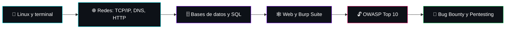

<!-- ================= CABECERA ================= -->
<p align="center">
  
</p>

<p align="center">
  
</p>

<p align="center">
  
  
  
</p>

<!-- Menu: badges SIN emojis en la URL (los emojis hacen fallar la carga) -->
<p align="center">
  <a href="#sobre-mi"></a>
  <a href="#arsenal"></a>
  <a href="#proyectos"></a>
  <a href="#roadmap"></a>
  <a href="#contacto"></a>
</p>

<br>

<!-- ================= SOBRE MI ================= -->
<a id="sobre-mi"></a>

## 👤 Sobre mí

<table>
<tr>
<td width="55%" valign="top">

```bash
user@fedora:~$ cat perfil.txt

nombre    = "Adria"
ubicacion = "Girona, España"
estudios  = "ASIX - Administración de Sistemas Informáticos en Red"
idiomas   = ["Español", "Català", "English (en progreso)"]
objetivo  = "Pentester / Bug Bounty Hunter"
os        = "Fedora Linux"
proyecto  = "DuSaQ S.L. - infraestructura de red y sistemas"
lema      = "Aprender. Romper. Reparar. Repetir."
```

</td>
<td width="45%" valign="top" align="center">

### 🎯 Mi misión

Entender **cómo funcionan** los sistemas y las redes para saber **cómo se rompen**, y así aprender a protegerlos.

> 💡 *"No se trata solo de hacer que funcione.
> Se trata de entender por qué funciona."*

</td>
</tr>
</table>

<br>

<!-- ================= ARSENAL ================= -->
<a id="arsenal"></a>

## 🔧 Arsenal

### 🛠 Lo que uso a diario

<p align="center">
  
  
  
  
  
  
  
</p>

### 🏢 Infraestructura con la que he trabajado (proyecto DuSaQ)

<p align="center">
  
  
  
  
  
  
  
  
  
</p>

### 🔎 Lo que estoy aprendiendo

<p align="center">
  
  
  
  
  
  
</p>

### 🏴‍☠️ Plataformas de práctica y objetivo

<p align="center">
  
  
  
  
  
</p>

<br>

<!-- ================= PROYECTOS ================= -->
<a id="proyectos"></a>

## 🚀 Proyectos

### 🏢 DuSaQ S.L. - Infraestructura de red y sistemas

Proyecto intermodular **en equipo**: diseño y montaje de la infraestructura completa de una empresa ficticia, **DuSaQ S.L.**, con dominio `DUSAQ.LOCAL`.

| Capa | Qué incluye | Herramientas |
|---|---|---|
| 🧱 **Perímetro** | Topología con **doble firewall** | `MikroTik` `Raspberry Pi` |
| 🔀 **Segmentación** | **5 VLANs** con direccionamiento `192.168.x.x` | `VLAN` |
| 🔑 **Identidad** | Controlador de dominio `DUSAQ.LOCAL` | `Samba AD DC` |
| 🌐 **Navegación** | Proxy con autenticación de usuarios | `Squid` `LDAP` `ncsa_auth` |
| 🚫 **Filtrado web** | Bloqueo por categorías con listas negras de la UT Capitole | `SquidGuard` |
| 🛡️ **Detección y prevención** | IDS/IPS en modo **NFQUEUE** | `Suricata` |
| 🌍 **Publicación** | Servidor web en la **DMZ** | `WordPress` |
| 📚 **Documentación** | Manuales de cliente, manuales técnicos y memoria técnica para el tribunal, redactados en catalán a lo largo de varios sprints | `Markdown` |

> 💡 **Lo que me llevo:** ver una red entera funcionando junta (firewalls, dominio, proxy, IDS y DMZ) me ayuda a entender qué se puede atacar y qué hay que proteger. Justo lo que necesito para el pentesting.

<table>
<tr>
<td width="50%" valign="top">

### 📝 Write-ups
Documentar lo que aprendo en TryHackMe y Hack The Box.


`Markdown` `CTF` `Notas`

</td>
<td width="50%" valign="top">

### 🧪 Laboratorio propio de pentesting
Máquinas vulnerables aisladas en VirtualBox para practicar sin riesgo.


`VirtualBox` `Kali` `Fedora`

</td>
</tr>
</table>

<br>

<!-- ================= ROADMAP ================= -->
<a id="roadmap"></a>

## 📍 Roadmap



### ✅ Objetivos

- [x] Empezar ASIX
- [x] Documentar un proyecto de infraestructura completo (DuSaQ S.L.)
- [ ] Dominar la terminal de Linux y Bash
- [ ] Entender a fondo TCP/IP con Wireshark
- [ ] Completar rutas de aprendizaje en TryHackMe
- [ ] Resolver mis primeras máquinas en Hack The Box
- [ ] Aprender el OWASP Top 10 con laboratorios prácticos
- [ ] Automatizar tareas con Python y Bash
- [ ] Mejorar mi inglés técnico
- [ ] Reportar mi primer bug 🐛
- [ ] Sacar mi primera certificación (eJPT / Security+)

<br>

<!-- ================= CONTACTO ================= -->
<a id="contacto"></a>

## 📬 Contacto

<p align="center">
  <a href="https://github.com/AdriaTG08"></a>
  <a href="https://www.linkedin.com/in/adri%C3%A0-tom%C3%A0s-g%C3%B3mez-297327357/"></a>
  <a href="mailto:adria_tomasgomez@iescarlesvallbona.cat"></a>
</p>

```bash
user@fedora:~$ echo "Aprender. Romper. Reparar. Repetir."
Aprender. Romper. Reparar. Repetir.
user@fedora:~$ _
```

<p align="center">
  ⭐ Si algo de aquí te resulta interesante, ¡deja una estrella!
</p>

<p align="center">
  
</p>

<!--
=====================================================================
  BLOQUES OPCIONALES (activalos quitando las marcas de comentario)
=====================================================================

  SERPIENTE (solo despues de ejecutar el workflow, ver paso 3):

  <h2>🐍 Actividad</h2>
  <p align="center">
    
  </p>

  ESTADISTICAS (pueden fallar si el servicio publico esta saturado):

  <h2>📊 Estadísticas</h2>
  <p align="center">
    
    
  </p>
  <p align="center">
    
  </p>
=====================================================================
-->
